# Dual-boot Microsoft Windows and your Linux-based system with your UEFI keys

... Windows 10 and recompiled-[Fedora](https://fedoraproject.org) 38 edition.

## Introduction

Let's imagine you're developing an operating system that utilizes the kernel Linux and want the system to support the Secure Boot mechanism. You've created the appropriate keys, certificates, EFI signature lists, made sure you followed security and compliance procedures and compiled the necessary bootchain components, signing them with your keys.

However, you soon found out the people who use your system want to dual-boot it alongside Microsoft Windows on their computers. Therefore, there has to be a way to boot both systems with your EFI signature lists enrolled.

This document is a guide on how to create a hands-on laboratory to prototype such scenario.

## The laboratory

To make a prototype, we'll be using [Oracle VirtualBox](https://www.virtualbox.org/) 7.0.10 r158379 as a virtualization solution, a Windows 10 system installed as a guest, as well as Fedora 38 installed as a guest alongside Microsoft Windows.  
Once the installation is complete, we'll generate our keys and certificates and recompile Fedora's bootchain components and see if both systems boot properly.

Justification:

Oracle VirtualBox is gratis to use and allows taking snapshots of virtual machines running in UEFI mode rather than legacy mode only (the main reason why it has been chosen over [virt-manager](https://virt-manager.org/)). It's cross-platform too. The version 7.0.10 r158379 was the current one during the time this document was being started for writing.  
According to the [VirtualBox 7.0 changelog](https://www.virtualbox.org/wiki/Changelog-7.0#v00), Secure Boot support has been added since VirtualBox 7.0.0 (released October 10 2022).

Windows 10 was a modern operating system with Secure Boot support during the time this document was being written.

[Fedora](https://fedoraproject.org) 38 will be our common platform used in place of the aforementioned custom Linux-based system because:

- [@aronowski](https://github.com/aronowski) (who was writing most of this document) has some hands-on experience with building Fedora/EL (Enterprise Linux) packages and was working their job primarily in this environment during the time this document was being written. People with more experience with e.g. [Debian](https://www.debian.org/) or other distro families may want to use their own preferred distros that currently are out of the scope of this guide.
- This platform is (subjectively) popular and easy to use both casually as well as for recompilation. Also, it utilizes UEFI shim, GRUB2 and GNU toolchain, making it a well-known and supported ecosystem. Big shout-out to the project and the people working on it!
- Creating a custom distribution is out of the scope of this guide, which can already be tough to handle for people who begin their adventure in this ecosystem.
- Version 38 was the current one during the time this document was being written.

## Things to keep in mind

This laboratory is supposed to be a simplification of what would be happening on production, therefore:

- We'll have SELinux disabled. In a production environment it should be left enabled, only tweaked to allow the crucial operations to succeed.
- Certificates, keys and EFI signature lists will be generated with no regard to expiration date, strength and location security - the usage of an HSM (at least FIPS 140-2-certified) is vital on production.
- Several workarounds and modifications will be used as part of building the bootchain components - maybe during the time of writing this document a proper handling of them has been misunderstood and they will be handled more gracefully on production, but this is yet to be documented.

## Prerequisites

### Creating our Virtual Machine

Set the Virtual Machine's name, set its `Type` to `Other` and `Version` to `Other/Unknown (64-bit)`

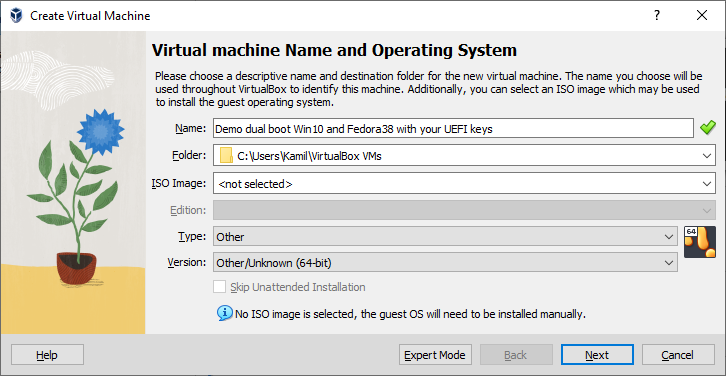

Set the `Base Memory` to 16 GB (`16384 MB`), `Processors` to `4` and switched on the `Enable EFI (special OSes only)` option

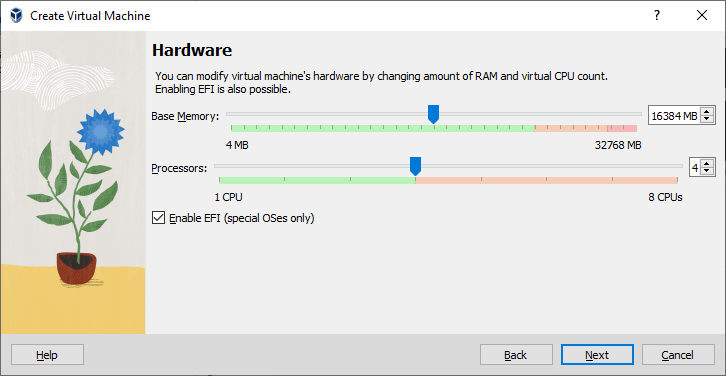

Set the `Disk Size` to `80,00 GB`

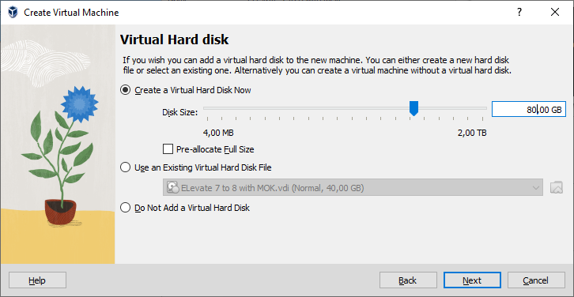

Reviewed the summary the wizard provided

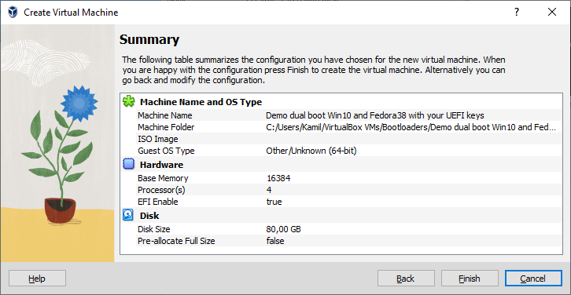

### Virtual Media Manager

Went to the Virtual Media Manager and released our *.vdi* disk

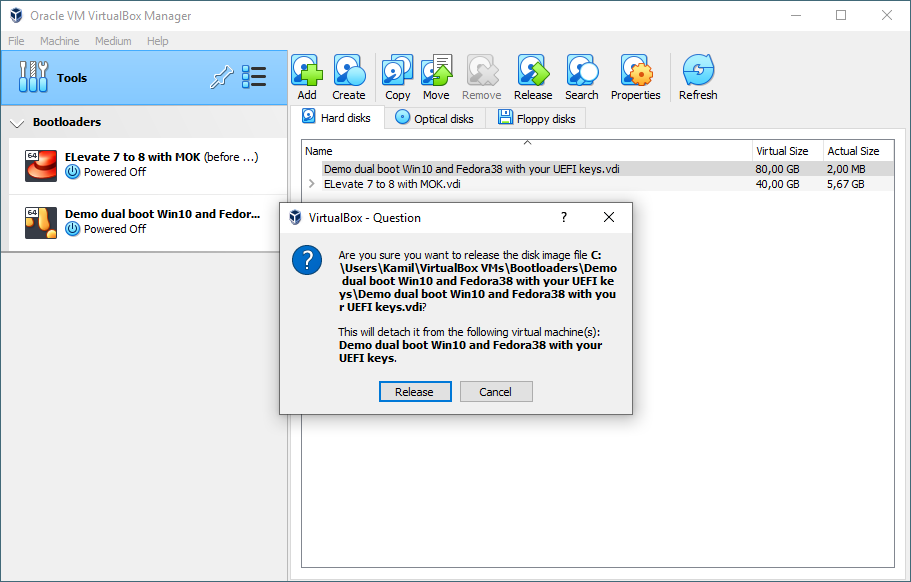

### Settings

Went to our Virtual Machine's Settings and...

#### System -> Motherboard:

- Changed `Pointing Device` from `PS/2 Mouse` to `USB Tablet`
- In `Extended Features` enabled the `Enable Secure Boot` option

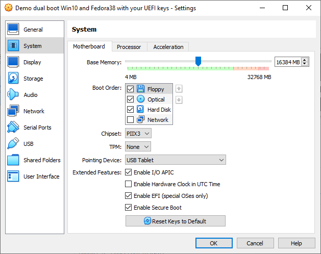

#### Display -> Screen:

- Maxed out available `Video Memory` to whatever the slider allows (in my case: 128 MB)
- Changed `Graphics Controller` from `VBoxVGA` to `VMSVGA`

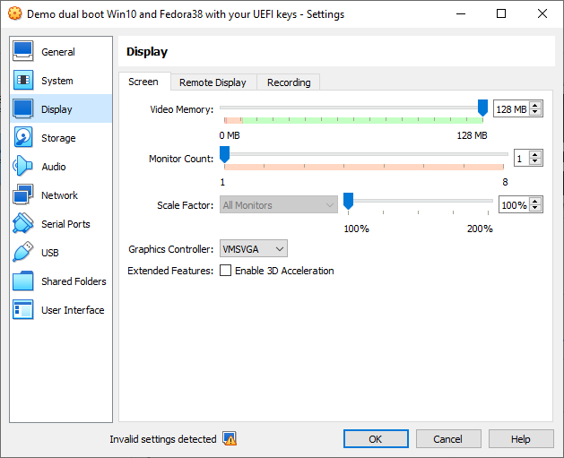

#### Storage -> Storage Devices

- Deleted the default IDE controller
- Added an LsiLogic SAS controller
- Added a hard disk and attached our *.vdi* disk
- Added an optical drive and attached a Windows 10 ISO

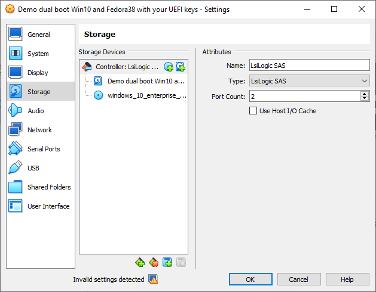

### Installing the operating systems

- Powered on the virtual machine, switched off the `Auto-resize Guest Display` option and switched off the `Connect Network Adapter` option
- During the installation of Windows 10 used the `Drive 0 Unallocated Space` for installation

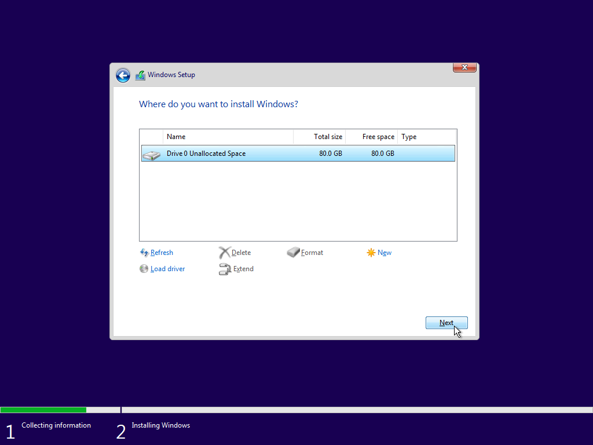

- Filled-in the required details during Windows initial setup and logged in to a desktop session
- Went to Advanced System Settings and disabled paging - this was required for shrinking a partition to the default suggested size

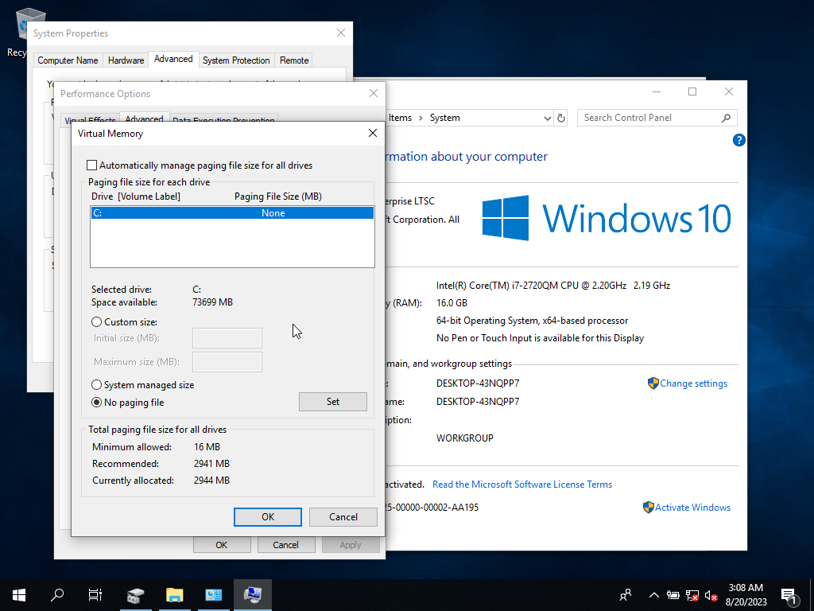

- Shrunk the `C:` volume with Microsoft Management Console

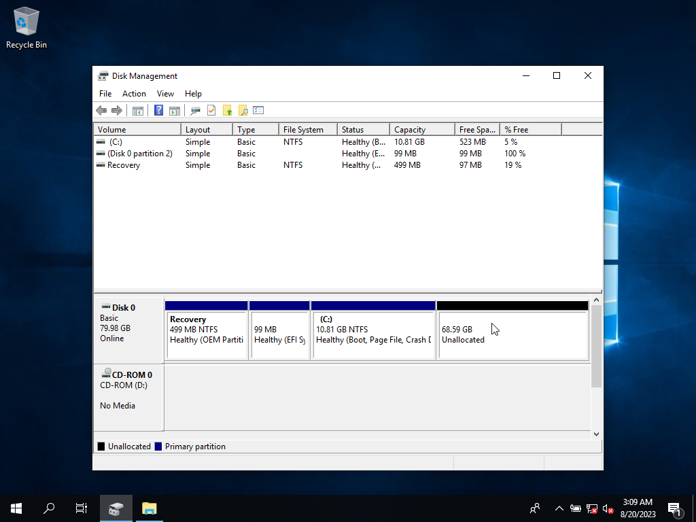

- Attached a Fedora 38 workstation ISO to the virtual machine
- rebooted the virtual machine, kept on mashing the *Escape* key to open the UEFI settings and booted from the *UEFI VBOX CD-ROM* from there

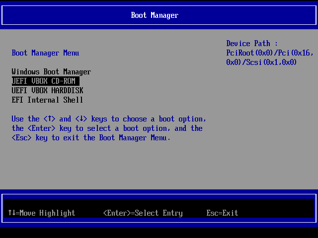

- Let Anaconda decide the best way of partitioning, just clicked on `Installation Destination` and clicked on the `Done` button

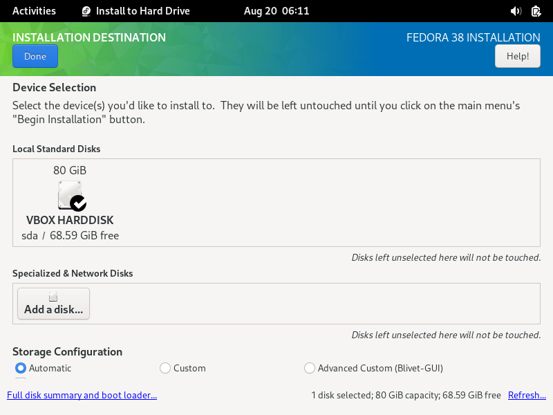

- Let Anaconda install Fedora 38 and rebooted the machine
- During GNOME initial setup selected to enable Third-Party Repositories
- Switched on the `Connect Network Adapter` option

## The work on Fedora 38

### Preparations and generating certs, keys and EFI sig lists

Let's install some packages. This step is vital as some things may not work correctly otherwise, e.g. scripts may exit silently with an error code. These shall also be most of the packages required for building the complete bootchain.

```
[user@fedora ~]$ sudo dnf install -y autoconf automake bison bpftool bzip2-devel dejavu-sans-fonts device-mapper-devel dwarves efitools elfutils-devel elfutils-libelf-devel flex freetype-devel fuse-devel gcc gcc-c++ gcc-plugin-devel gettext-devel glibc-static help2man kernel-rpm-macros make ncurses-devel openssl openssl-devel perl-devel perl-generators pesign python3-devel rpm-devel rpmdevtools squashfs-tools systemd-boot-unsigned texinfo xz-devel
```

Once they are installed, please update your system with `sudo dnf update -y`.

Then, switch to the *root* account and do the following:  

Create directories which will be used for holding our assets. Let's start with backing up the keys we already have enrolled.

```
[root@fedora ~]# mkdir -p /etc/kernel_key/efikeys.orig/
[root@fedora ~]# chmod 700 /etc/kernel_key/efikeys.orig/
[root@fedora ~]# cd /etc/kernel_key/efikeys.orig/

[root@fedora efikeys.orig]# efi-readvar -v PK -o old_PK.esl
[root@fedora efikeys.orig]# efi-readvar -v KEK -o old_KEK.esl
[root@fedora efikeys.orig]# efi-readvar -v db -o old_db.esl
[root@fedora efikeys.orig]# efi-readvar -v dbx -o old_dbx.esl
```

Backtrack and generate your own keys, certificates and EFI sig lists; sign whatever is appropriate right now (old dbx) as well.

```
[root@fedora efikeys.orig]# cd /etc/kernel_key/
[root@fedora kernel_key]# openssl req -new -x509 -newkey rsa:2048 -subj "/CN=aronowski's platform key/" -keyout PK.key -out PK.crt -days 3650 -nodes -sha256
[root@fedora kernel_key]# openssl req -new -x509 -newkey rsa:2048 -subj "/CN=aronowski's key-exchange-key/" -keyout KEK.key -out KEK.crt -days 3650 -nodes -sha256
[root@fedora kernel_key]# openssl req -new -x509 -newkey rsa:2048 -subj "/CN=aronowski's db/" -keyout db.key -out db.crt -days 3650 -nodes -sha256
[root@fedora kernel_key]# chmod 400 *.key

[root@fedora kernel_key]# cert-to-efi-sig-list -g "$(uuidgen)" PK.crt PK.esl
[root@fedora kernel_key]# sign-efi-sig-list -k PK.key -c PK.crt PK PK.esl PK.auth
[root@fedora kernel_key]# cert-to-efi-sig-list -g "$(uuidgen)" KEK.crt KEK.esl
[root@fedora kernel_key]# sign-efi-sig-list -a -k PK.key -c PK.crt KEK KEK.esl KEK.auth
[root@fedora kernel_key]# cert-to-efi-sig-list -g "$(uuidgen)" db.crt db.esl
[root@fedora kernel_key]# sign-efi-sig-list -a -k KEK.key -c KEK.crt db db.esl db.auth

[root@fedora kernel_key]# cp efikeys.orig/old_dbx.esl ./
[root@fedora kernel_key]# sign-efi-sig-list -k KEK.key -c KEK.crt dbx old_dbx.esl old_dbx.auth
```

And merge whatever else there's left, then sign the merged lists.

```
[root@fedora kernel_key]# cp efikeys.orig/old_KEK.esl ./
[root@fedora kernel_key]# cp efikeys.orig/old_db.esl ./
[root@fedora kernel_key]# cat old_KEK.esl KEK.esl > compound_KEK.esl
[root@fedora kernel_key]# cat old_db.esl db.esl > compound_db.esl
[root@fedora kernel_key]# sign-efi-sig-list -k PK.key -c PK.crt KEK compound_KEK.esl compound_KEK.auth
[root@fedora kernel_key]# sign-efi-sig-list -k KEK.key -c KEK.crt db compound_db.esl compound_db.auth
```

Reboot the machine, go to UEFI settings, turn Secure Boot off and remove all the default keys. Then, let's install our new ones:

```
[root@fedora ~]# cd /etc/kernel_key/

[root@fedora kernel_key]# setenforce 0

[root@fedora kernel_key]# efi-updatevar -f PK.auth PK
[root@fedora kernel_key]# efi-updatevar -f compound_KEK.auth KEK
[root@fedora kernel_key]# efi-updatevar -f compound_db.auth db
[root@fedora kernel_key]# efi-updatevar -f old_dbx.auth dbx

[root@fedora kernel_key]# efi-readvar 
Variable PK, length 855
PK: List 0, type X509
    Signature 0, size 827, owner 1fbf06e1-8099-4643-ad71-7fcc21c594be
        Subject:
            CN=aronowski's platform key
        Issuer:
            CN=aronowski's platform key
Variable KEK, length 2423
KEK: List 0, type X509
    Signature 0, size 1532, owner 77fa9abd-0359-4d32-bd60-28f4e78f784b
        Subject:
            C=US, ST=Washington, L=Redmond, O=Microsoft Corporation, CN=Microsoft Corporation KEK CA 2011
        Issuer:
            C=US, ST=Washington, L=Redmond, O=Microsoft Corporation, CN=Microsoft Corporation Third Party Marketplace Root
KEK: List 1, type X509
    Signature 0, size 835, owner 980e1406-6d55-4794-b49e-d24f61f2f72d
        Subject:
            CN=aronowski's key-exchange-key
        Issuer:
            CN=aronowski's key-exchange-key
Variable db, length 4010
db: List 0, type X509
    Signature 0, size 1572, owner 77fa9abd-0359-4d32-bd60-28f4e78f784b
        Subject:
            C=US, ST=Washington, L=Redmond, O=Microsoft Corporation, CN=Microsoft Corporation UEFI CA 2011
        Issuer:
            C=US, ST=Washington, L=Redmond, O=Microsoft Corporation, CN=Microsoft Corporation Third Party Marketplace Root
db: List 1, type X509
    Signature 0, size 1515, owner 77fa9abd-0359-4d32-bd60-28f4e78f784b
        Subject:
            C=US, ST=Washington, L=Redmond, O=Microsoft Corporation, CN=Microsoft Windows Production PCA 2011
        Issuer:
            C=US, ST=Washington, L=Redmond, O=Microsoft Corporation, CN=Microsoft Root Certificate Authority 2010
db: List 2, type X509
    Signature 0, size 839, owner 9b5414f7-d4f8-4f5f-94c4-125724108ed9
        Subject:
            CN=aronowski's db
        Issuer:
            CN=aronowski's db
Variable dbx, length 3724
dbx: List 0, type SHA256
    Signature 0, size 48, owner 77fa9abd-0359-4d32-bd60-28f4e78f784b
        Hash:80b4d96931bf0d02fd91a61e19d14f1da452e66db2408ca8604d411f92659f0a
    Signature 1, size 48, owner 77fa9abd-0359-4d32-bd60-28f4e78f784b
        Hash:f52f83a3fa9cfbd6920f722824dbe4034534d25b8507246b3b957dac6e1bce7a
    Signature 2, size 48, owner 77fa9abd-0359-4d32-bd60-28f4e78f784b
        Hash:c5d9d8a186e2c82d09afaa2a6f7f2e73870d3e64f72c4e08ef67796a840f0fbd
    [...]
    Signature 74, size 48, owner 77fa9abd-0359-4d32-bd60-28f4e78f784b
        Hash:939aeef4f5fa51e23340c3f2e49048ce8872526afdf752c3a7f3a3f2bc9f6049
    Signature 75, size 48, owner 77fa9abd-0359-4d32-bd60-28f4e78f784b
        Hash:64575bd912789a2e14ad56f6341f52af6bf80cf94400785975e9f04e2d64d745
    Signature 76, size 48, owner 77fa9abd-0359-4d32-bd60-28f4e78f784b
        Hash:45c7c8ae750acfbb48fc37527d6412dd644daed8913ccd8a24c94d856967df8e
Variable MokList has no entries

```

Let's generate certificates and keys. They will be used for recompiling bootchain components.  
*Note: we're doing all this as an unprivileged user, rather than root.*

```
[user@fedora ~]$ git clone https://github.com/rhboot/shim.git
[user@fedora ~]$ cd shim/
[user@fedora shim]$ ./make-certs aronowski kamil.aronowski@yahoo.com
Warning: ignoring -CAserial option since -CA option is not given
Certificate request self-signature ok
subject=C = US, L = SomeCity, O = SomeOrg
Using configuration from /home/user/shim/openssl.cnf
Warning: output encryption option -nodes ignored with -export
CA certificate:
issuer=C  US, L  SomeCity, O  SomeOrg
subject=C  US, L  SomeCity, O  SomeOrg

End entity certificate:
issuer=C  US, L  SomeCity, O  SomeOrg
subject=C  US, L  SomeCity, O  SomeOrg, CN  aronowski
serial 01

PKCS12 bag:
MAC: sha256, Iteration 2048
MAC length: 32, salt length: 8
PKCS7 Encrypted data: PBES2, PBKDF2, AES-256-CBC, Iteration 2048, PRF hmacWithSHA256
Certificate bag
PKCS7 Data
Shrouded Keybag: PBES2, PBKDF2, AES-256-CBC, Iteration 2048, PRF hmacWithSHA256

Verifying:
+ openssl verify -CAfile ca.chain.crt aronowski.crt
aronowski.crt: OK

[user@fedora shim]$ openssl x509 -outform DER -in ca.crt -out aronowskiCA.cer
```

### Let's rebuild the bootchain components

First, let's add ourselves to the `pesign` group, which will allow us to use the default NSS database pesign uses:

```
[user@fedora ~]$ sudo usermod -a -G pesign $USER
```

Once that's done, let's log out or even better reboot the machine. Once it's rebooted...

#### shim-unsigned

...let's start with building and installing an unsigned shim.

```
[user@fedora ~]$ rpmdev-setuptree
[user@fedora ~]$ dnf download --source shim-unsigned-x64
[...]
[user@fedora ~]$ rpmdev-extract -C ~/rpmbuild/SOURCES/ shim-unsigned-x64-15.6-1.src.rpm 
[...]
[user@fedora ~]$ cd ~/rpmbuild/SOURCES/
[user@fedora SOURCES]$ mv */* .
```

The building requires adding a new SBAT entry, our CA certificate, as well as modifying the certificate's mention in the specfile.

```
[user@fedora SOURCES]$ echo 'shim.aronowski,1,Kamil Aronowski,shim,15.6,kamil.aronowski@yahoo.com' >> sbat.redhat.csv
[user@fedora SOURCES]$ cp ~/shim/aronowskiCA.cer .
[user@fedora SOURCES]$ sed -i 's@fedora-ca-20200709.cer@aronowskiCA.cer@g' *.spec
[user@fedora SOURCES]$ grep aronowskiCA *.spec
Source1:	aronowskiCA.cer
```

Let's go!

```
[user@fedora SOURCES]$ rpmbuild -ba *.spec
[...]
[user@fedora SOURCES]$ sudo dnf install -y ~/rpmbuild/RPMS/**/*.rpm ; sudo dnf reinstall -y ~/rpmbuild/RPMS/**/*.rpm
[...]
```

#### shim-signed

Let's build shim-signed.

```
[user@fedora SOURCES]$ cd
[user@fedora ~]$ rpmdev-wipetree
[user@fedora ~]$ dnf download --source shim
[user@fedora ~]$ rpmdev-extract -C ~/rpmbuild/SOURCES/ shim-15.6-2.src.rpm
[user@fedora ~]$ cd ~/rpmbuild/SOURCES/
[user@fedora SOURCES]$ mv */* .
```

The build requires us to replace the `shimx64.efi` binary provided in the SRPM with our own one - the one we built earlier. The same has been done with the `BOOTX64.CSV` file just in case.  
Once we have our (unsigned) binary in here, we must sign it ourselves with our `db` key and `db` certificate.

```
[user@fedora SOURCES]$ rm -f shimx64.efi BOOTX64.CSV
[user@fedora SOURCES]$ cp /usr/share/shim/15.6-1/x64/shimx64.efi .
[user@fedora SOURCES]$ cp /usr/share/shim/15.6-1/x64/BOOTX64.CSV .
[user@fedora SOURCES]$ sudo sbsign --cert /etc/kernel_key/db.crt --key /etc/kernel_key/db.key shimx64.efi
warning: data remaining[801792 vs 927275]: gaps between PE/COFF sections?
warning: data remaining[801792 vs 927280]: gaps between PE/COFF sections?
Signing Unsigned original image
[user@fedora SOURCES]$ mv shimx64.efi.signed shimx64.efi
[user@fedora SOURCES]$ sudo chown $USER: shimx64.efi
```

Let's verify that the shim binary is correct - just in case:

```
[user@fedora SOURCES]$ sbverify --list shimx64.efi
warning: data remaining[803392 vs 928880]: gaps between PE/COFF sections?
signature 1
image signature issuers:
 - /CN=aronowski's db
image signature certificates:
 - subject: /CN=aronowski's db
   issuer:  /CN=aronowski's db

[user@fedora SOURCES]$ objcopy -O binary --only-section=.sbat shimx64.efi /dev/stdout
sbat,1,SBAT Version,sbat,1,https://github.com/rhboot/shim/blob/main/SBAT.md
shim,2,UEFI shim,shim,1,https://github.com/rhboot/shim
shim.rh,2,The Fedora Project,shim,15.6,https://src.fedoraproject.org/rpms/shim-unsigned-x64
shim.aronowski,1,Kamil Aronowski,shim,15.6,kamil.aronowski@yahoo.com
```

Let's enable the pesign daemon and unlock our token (in the case of this laboratory it will be the internal NSS Certificate Database rather than an HSM):

```
[user@fedora SOURCES]$ sudo systemctl enable pesign --now
Created symlink /etc/systemd/system/multi-user.target.wants/pesign.service → /usr/lib/systemd/system/pesign.service.

[user@fedora SOURCES]$ pesign-client --unlock --token "NSS Certificate DB"
Enter passphrase for private key:

[user@fedora SOURCES]$ pesign-client --is-unlocked --token 'NSS Certificate DB'
token "NSS Certificate DB" is unlocked
```

Let's import our `.p12` file to our token:

```
[user@fedora SOURCES]$ pk12util -d /etc/pki/pesign -i $HOME/shim/aronowski.p12
Enter password for PKCS12 file: 
pk12util: PKCS12 IMPORT SUCCESSFUL

[user@fedora SOURCES]$ certutil -d /etc/pki/pesign -L -h "NSS Certificate DB"

Certificate Nickname                                         Trust Attributes
                                                             SSL,S/MIME,JAR/XPI

aronowski                                                    u,u,u
```

And we're ready to build and install the package with one workaround (removing one line from the macros file) during the time this document was being written:

```
[user@fedora SOURCES]$ sed -i '83d' shim.rpmmacros
[user@fedora SOURCES]$ sudo setenforce 0

[user@fedora SOURCES]$ rpmbuild -D 'pe_signing_token NSS Certificate DB' -D 'pe_signing_cert aronowski' -ba *.spec
[...]
[user@fedora SOURCES]$ sudo dnf install -y ~/rpmbuild/RPMS/**/*.rpm ; sudo dnf reinstall -y ~/rpmbuild/RPMS/**/*.rpm
[...]
```

#### GRUB2

Let's build and install GRUB2.

```
[user@fedora SOURCES]$ cd
[user@fedora ~]$ rpmdev-wipetree
[user@fedora ~]$ dnf download --source grub2
[user@fedora ~]$ rpmdev-extract -C ~/rpmbuild/SOURCES/ grub2-2.06-95.fc38.src.rpm
[user@fedora ~]$ cd ~/rpmbuild/SOURCES/
[user@fedora SOURCES]$ mv */* .
```

Adding our SBAT entry:

```
[user@fedora SOURCES]$ echo 'grub.aronowski,1,Kamil Aronowski,grub2,@@VERSION_RELEASE@@,mailto:kamil.aronowski@yahoo.com' >> sbat.csv.in
```

And we're ready to build and install the package with one workaround (forcing our certificate nickname in the macros file) during the time this document was being written:

```
[user@fedora SOURCES]$ sed -i 's@grub2-signer@aronowski@g' grub.macros
[user@fedora SOURCES]$ rpmbuild -D 'pe_signing_token NSS Certificate DB' -D 'pe_signing_cert aronowski' -ba *.spec
[...]
[user@fedora SOURCES]$ sudo dnf install -y ~/rpmbuild/RPMS/**/*.rpm ; sudo dnf reinstall -y ~/rpmbuild/RPMS/**/*.rpm
[...]
```

#### kernel

Let's try to build the kernel and its modules.

```
[user@fedora SOURCES]$ cd
[user@fedora ~]$ dnf download --source kernel
[user@fedora ~]$ rpmdev-extract -C ~/rpmbuild/SOURCES/ kernel-6.4.11-200.fc38.src.rpm
[user@fedora ~]$ cd ~/rpmbuild/SOURCES/
[user@fedora SOURCES]$ mv */* .

[user@fedora SOURCES]$ sudo setenforce 0
[user@fedora SOURCES]$ sudo dnf builddep -y *.spec
```

We need both our CA certificate as well as the regular one in DER format in here.

```
[user@fedora SOURCES]$ cp ~/shim/aronowskiCA.cer .
[user@fedora SOURCES]$ openssl x509 -outform DER -in ~/shim/aronowski.pem -out aronowski.cer
[user@fedora SOURCES]$ sed -i 's%redhatsecurebootca.%aronowskiCA%g;s%redhatsecureboot[0-9][0-9][0-9]%aronowski%g' kernel.spec
```

Let's have our ephemeral key with our name:

```
[user@fedora SOURCES]$ sed -i 's%Fedora%aronowski%g;s%kernel-team@fedoraproject.org%kamil.aronowski@yahoo.com%g' x509.genkey.fedora
```

And we're ready to build and install our kernel and its modules:

```
[user@fedora SOURCES]$ rpmbuild -D 'pe_signing_token NSS Certificate DB' -D 'pe_signing_cert aronowski' --with release --without debug --without debuginfo -ba *.spec
[...]
[user@fedora SOURCES]$ sudo dnf install -y ~/rpmbuild/RPMS/**/*.rpm ; sudo dnf reinstall -y ~/rpmbuild/RPMS/**/*.rpm
[...]
```

### Post-build

Once the bootchain components have all been recompiled and installed, switch off the virtual machine and take a snapshot.

## Verify that this works as intended.

With our current setup we'll have the following (simplified) bootchains (by default - unless booting manually from the UEFI settings):

- For **Windows**: `shimx64.efi` -> `grubx64.efi` -> `bootmgfw.efi` -> ...
- For **Fedora**: `shimx64.efi` -> `grubx64.efi` -> `vmlinuz` -> ...

Therefore with Secure Boot switched on, the following should occur:

1. With our compound EFI sig lists both bootchains should work.
2. With our-only EFI sig lists we should only be able to boot to Fedora
3. With the ones provided by default, we should only be able to boot Windows from the UEFI settings rather than from (therefore inaccessible) GRUB2.

Let's try these out. We do have a snapshot just in case we need to go back.

### compound EFI sig lists

Make sure Secure Boot is enabled in UEFI settings and simply boot to Fedora and Windows. If we can get to the login screen, everything works as expected.

### our-only EFI sig lists

Switch off Secure Boot in UEFI settings. Delete PK, KEK and DB from UEFI settings, boot into Fedora and enroll our non-compound EFI sig lists:

```
[root@fedora ~]# cd /etc/kernel_key/
[root@fedora kernel_key]# sign-efi-sig-list -k PK.key -c PK.crt KEK KEK.esl KEK.auth
[root@fedora kernel_key]# sign-efi-sig-list -k KEK.key -c KEK.crt db db.esl db.auth
[root@fedora kernel_key]# efi-updatevar -f PK.auth PK
[root@fedora kernel_key]# efi-updatevar -f KEK.auth KEK
[root@fedora kernel_key]# efi-updatevar -f db.auth db
```

Then reboot. Go to UEFI settings and switch on Secure Boot. Only the Fedora bootchain should work - attempting to boot `bootmgfw.efi` should either throw an error or, if attempting to boot from UEFI settings, refuse to load.

### default EFI sig lists

Switch off Secure Boot in UEFI settings. Delete PK, KEK and DB from UEFI settings, boot into Fedora and enroll the default EFI sig lists:
*Note: 77fa9abd-0359-4d32-bd60-28f4e78f784b is just Microsoft's GUID*

```
[root@fedora ~]# cd /etc/kernel_key/
[root@fedora kernel_key]# sign-efi-sig-list -k PK.key -c PK.crt KEK old_KEK.esl old_KEK.auth
[root@fedora kernel_key]# sign-efi-sig-list -g 77fa9abd-0359-4d32-bd60-28f4e78f784b -k KEK.key -c KEK.crt db old_db.esl old_db.auth
[root@fedora kernel_key]# efi-updatevar -f old_db.auth db
[root@fedora kernel_key]# efi-updatevar -f old_KEK.auth KEK
[root@fedora kernel_key]# efi-updatevar -f PK.auth PK
```

Then reboot. We should get a Security Violation initially during the virtual machine startup (since our `shimx64.efi` can't be verified), and a likely-unsuccessful attempt to boot Windows will follow up.

Reboot the machine again, go to UEFI settings and boot Windows from there. It should boot just fine.

## Summary

We've come a long way, but we've managed to prove that it's indeed possible to dual-boot Microsoft Windows and your own Linux-based system (yes, you recompiled Fedora's bootchain, so it has your certificates, therefore the bootchain's all yours) with your own UEFI keys, just as the scenario from the [Introduction](#introduction) section required us to do.

Now, all that's left to do is implement the scenario in a production environment with the proper security practices described in the [Things to keep in mind](#things-to-keep-in-mind) section. Good luck!

---

This work, "Dual-boot Microsoft Windows and your Linux-based system with your UEFI keys", is adapted from the post "[Jak dodać własne klucze dla Secure Boot do firmware EFI/UEFI pod linux](https://morfikov.github.io/post/jak-dodac-wlasne-klucze-dla-secure-boot-do-firmware-efi-uefi-pod-linux/)" by [Mikhail Morfikov](https://github.com/morfikov). This post is licensed under the [Creative Commons Attribution-NonCommercial-ShareAlike 4.0 International license](https://creativecommons.org/licenses/by-nc-sa/4.0/).  
© 2020-2023 [Mikhail Morfikov](https://github.com/morfikov)

Several commands and listings were based on the ones from the aforementioned post, either reused or with the change of each document author's surname, when appropriate, i.e., during the generation of keys or certificates. "Dual-boot Microsoft Windows and your Linux-based system with your UEFI keys" is licensed under the [Creative Commons Attribution-NonCommercial-ShareAlike 4.0 International license](https://creativecommons.org/licenses/by-nc-sa/4.0/).  
© 2023 [Kamil Aronowski](https://github.com/aronowski)

Practical implementation of the information contained in the document as part of the help with prototyping, error reports, and clarifications, e.g. on the VirtualBox release 7.0 by [Kacper Paczos](https://github.com/kacperpaczos).
